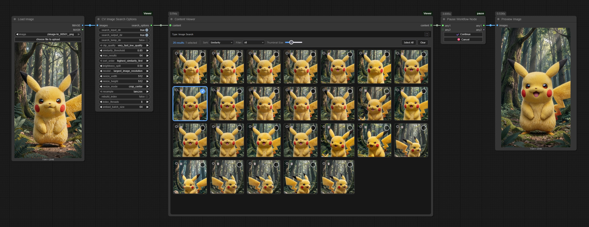
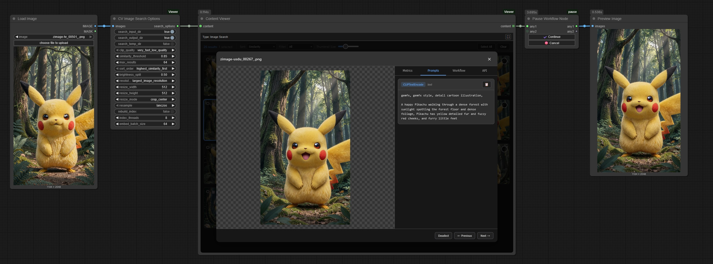
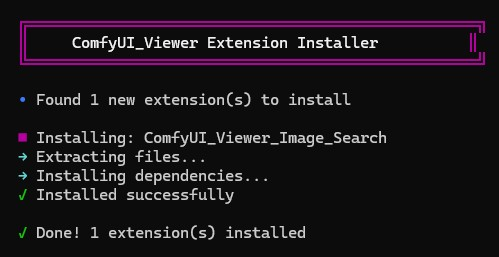

# ComfyUI Viewer - Image Search Extension


A view extension for [ComfyUI Viewer](https://github.com/WASasquatch/ComfyUI_Viewer) that adds CLIP-based image similarity search with an interactive gallery interface.

# Screenshots

<details>
<summary><strong>Screenshots</strong></summary>





</details>

## Features

- **CLIP-based Similarity Search**: Search your ComfyUI input/output/temp directories for visually similar images
- **Interactive Gallery**: Browse results with sorting, filtering, and selection
- **Metrics Display**: View image dimensions, brightness, file size
- **Workflow Extraction**: View embedded ComfyUI workflows from PNG images
- **Selection & Output**: Select specific images to output as IMAGE tensors

## Installation

### Prerequisites

- [ComfyUI](https://github.com/comfyanonymous/ComfyUI) installed
- [ComfyUI Viewer](https://github.com/WASasquatch/ComfyUI_Viewer)  **v0.3.0 or higher** installed

### Install Steps

1. **Download the ZIP from GitHub**


2. **Extract the ZIP to your `ComfyUI/custom_nodes/ComfyUI_Viewer/extensions` folder**
3. **Restart ComfyUI** and the extension will be installed and loaded.




## Workflow Setup

It's highly recommended to use a pause node to prevent the graph from running while you are selecting images. 

I recomment [ComfyUI-pause](https://github.com/wywywywy/ComfyUI-pause)

Overview of Workflow:

[Load Image] → [CV Image Search Options] → [Content Viewer] → [[ComfyUI-pause](https://github.com/wywywywy/ComfyUI-pause) Node] → [Save Image]


Using the pause node, the workflows first run is the "Search Run" or "Dry Run" and will be suspended. This will allow you time to select images from the gallery. When you are finished, you should select the "Cancel" button and run the workflow again for your selection to pass, otherwise the input image will be passed if you click "Continue". 

1. **CV Image Search Options**: Connect your query image and configure search parameters
2. **Content Viewer**: Will automatically detect CV Image Search Options and displays the interactive gallery, select images, and outputs them as IMAGE tensors
3. **ComfyUI-pause Node**: Pause the workflow to allow you time to select images from the gallery for 

### Node: CV Image Search Options

| Input | Type | Description |
|-------|------|-------------|
| images | IMAGE | Query image(s) to search for similar images |
| search_input_dir | BOOLEAN | Search ComfyUI input directory |
| search_output_dir | BOOLEAN | Search ComfyUI output directory |
| search_temp_dir | BOOLEAN | Search ComfyUI temp directory |
| clip_quality | COMBO | Model quality: very_fast_low_quality, balanced, high_quality_slow |
| similarity_threshold | FLOAT | Minimum similarity score (0-1) |
| max_results | INT | Maximum results to return |
| rebuild_index | BOOLEAN | Rebuild index |
| brightness_split | FLOAT | Threshold for dark/light categorization |
| resize_* | Various | Output image resize options |

### Gallery Controls

- **Click**: Open image in modal view
- **Shift+Click** or **Right-click**: Toggle selection
- **Sort**: Similarity, Dark/Light first, Size, Filename
- **Filter**: All, Dark only, Light only, With workflow
- **Size slider**: Adjust thumbnail size

### Modal View

- **Arrow keys**: Navigate between images
- **Space**: Toggle selection
- **Escape**: Close modal
- **Tabs**: View Metrics, Prompts, Workflow, API Prompt
- **Copy buttons**: JSON values will have copy buttons, you can also copy the workflow to paste click on ComfyUI Graph and paste to load the workflow.

## CLIP Models

| Quality | Model | Speed | Accuracy |
|---------|-------|-------|----------|
| very_fast_low_quality | clip-vit-base-patch32 | Fastest | Lower |
| balanced | clip-vit-base-patch16 | Medium | Medium |
| high_quality_slow | clip-vit-large-patch14 | Slowest | Highest |

## Caching

The extension caches CLIP embeddings to speed up subsequent searches. Cache is stored in:
```
ComfyUI/custom_nodes/ComfyUI_Viewer/.cache/image_search/
```

To rebuild the cache, enable "rebuild_index" in the CV Image Search Options node.

## License

MIT License - See LICENSE file for details.
